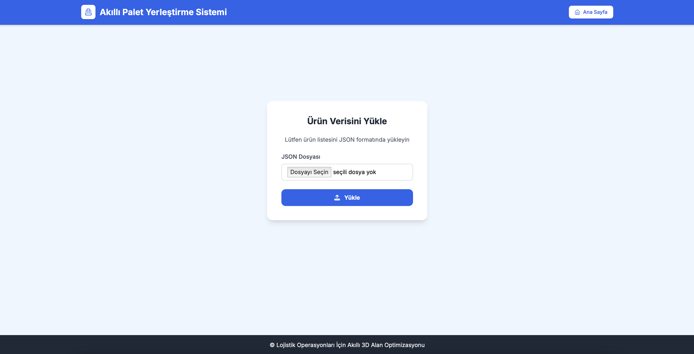
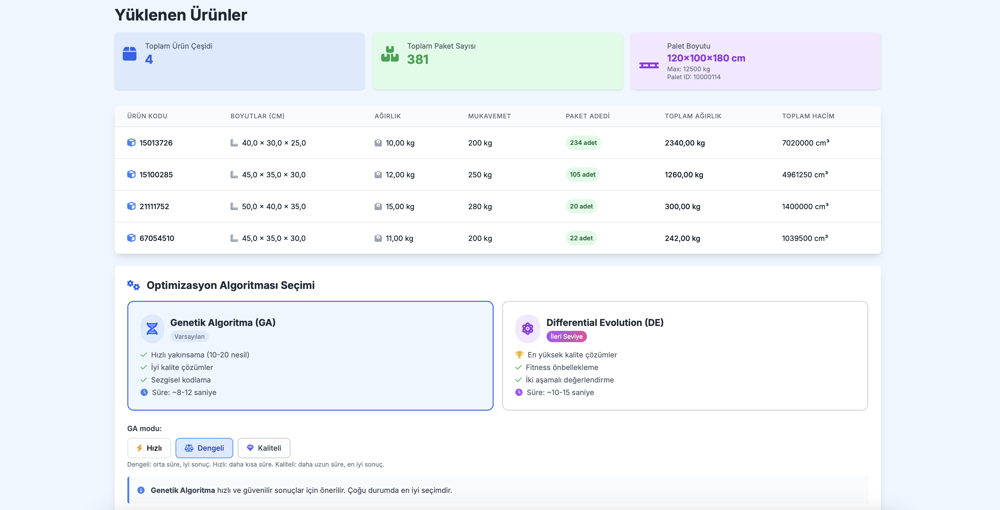
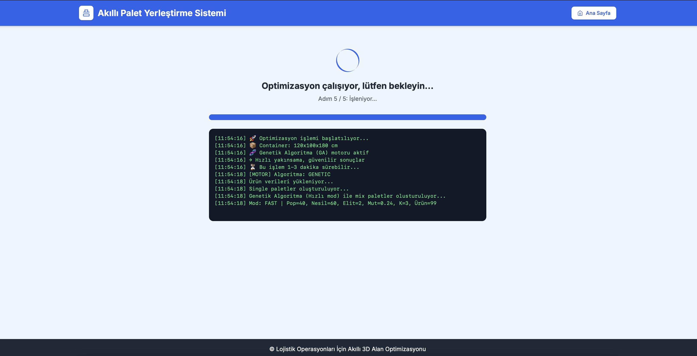
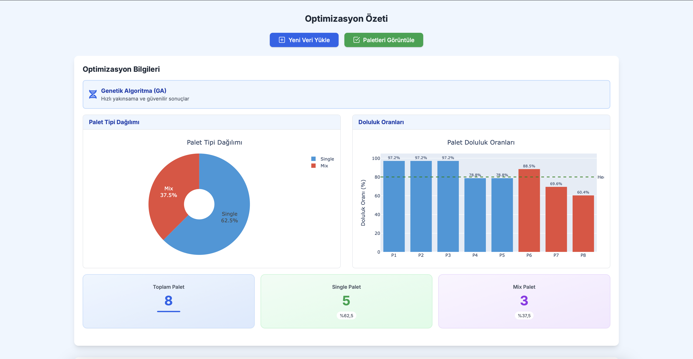
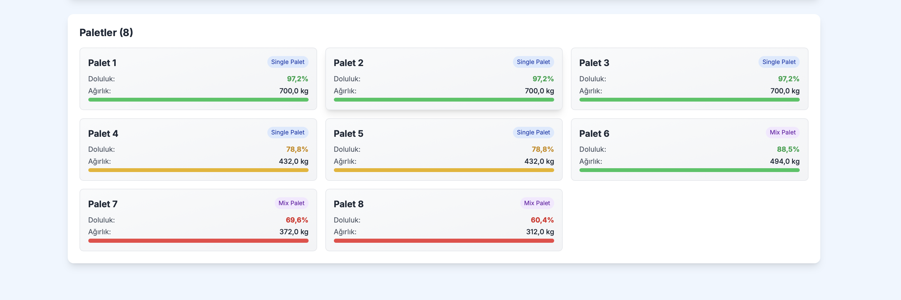
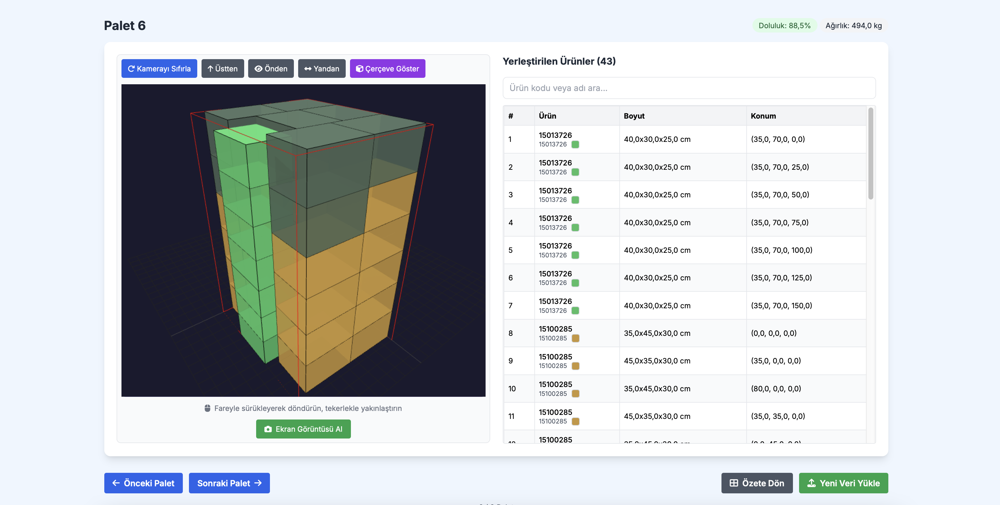
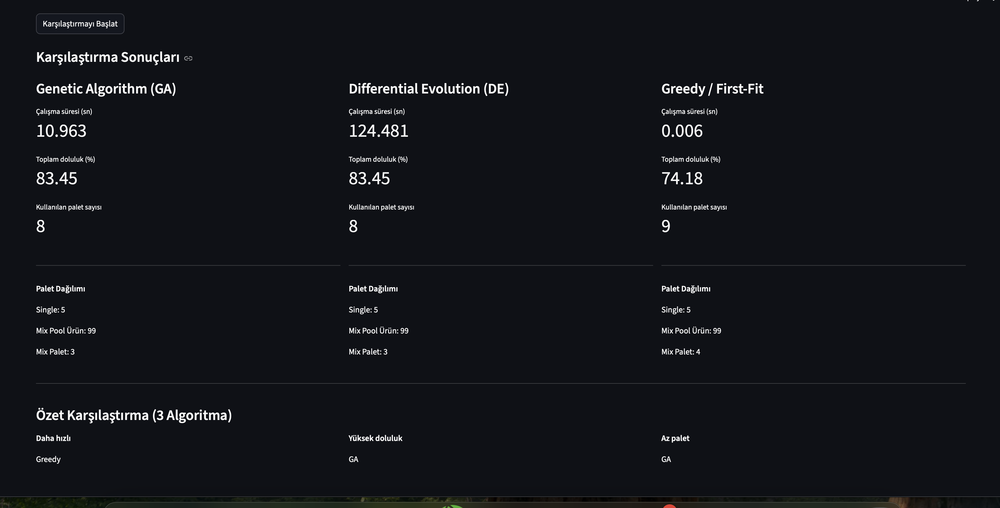

# Akıllı Palet Yerleştirme Sistemi (3D Bin Packing Optimization Engine)

[](https://www.python.org/)
[](https://www.djangoproject.com/)
[](LICENSE)

## 🧭 User Workflow

### 1. Upload Product Data


### 2. Review Products & Select Algorithm


### 3. Optimization Process


### 4. Optimization Results


### 5. Pallet Breakdown


### 6. 3D Visualization


## 🔬 Benchmark Comparison



## 📋 About the Project

**3D Bin Packing Optimization Engine** is a professional, hybrid optimization solution for solving the NP-Hard 3D bin packing problem using a pipeline of specialized algorithms.

The system operates through a **two-stage optimization pipeline**:

1. **Stage 1: Single Pallet Pre-pass**
   - Identifies high-efficiency groups of identical products
   - Creates single-product pallets with maximum utilization
   - Reduces items remaining for mixed optimization

2. **Stage 2: Mix Pool Optimization**
   - Handles remaining, mixed-product inventory
   - Supports three different optimization approaches:
     - **Greedy (Baseline)**: Deterministic, ultra-fast heuristic
     - **Genetic Algorithm (GA)**: Population-based evolutionary approach
     - **Differential Evolution (DE)**: Advanced hybrid mutation with adaptive strategies

**Core objectives:**
- ✅ Place products in containers optimally
- ✅ Minimize empty space (maximize container utilization)
- ✅ Ensure weight balance and structural stability
- ✅ Enforce realistic warehouse constraints (rotation, weight limits, stacking rules)
- ✅ Provide web-based interactive analysis interface

## 🎯 Key Features

- **Hybrid Optimization Pipeline**: Two-stage processing (single + mixed pallets)
- **Multiple Algorithms**: Greedy (fast baseline), GA (metaheuristic), DE (adaptive metaheuristic)
- **Realistic Packing Constraints**: Void penalties, layer snapping, edge bias, cavity detection
- **Single + Mixed Pallet Strategy**: Optimized separation of high-efficiency groups
- **Web Interface (Django)**: Product/container management, 3D visualizations, results analysis
- **Built-in Benchmark Page**: Compare GA, DE, and Greedy on the same input in the web UI
- **Flexible Algorithm Selection**: Choose best-fit method for your requirements

## 🚀 Optimization Pipeline

### Result Dashboard Example


### 3D Pallet Visualization


The optimization workflow processes items through a structured pipeline:

1. **JSON Input Parsing**
  - Load `container` and `details[*].product` structure from JSON files
  - Validate constraints (dimensions, weights, rotation rules)

2. **Single Pallet Optimization (High-Efficiency Groups)**
   - Identify products with identical dimensions and weight
   - Create dedicated single-product pallets with maximum utilization
   - Use grid-based placement for stack stability

3. **Remaining Items → Mix Pool**
   - Collect unoptimized or low-quantity items
   - Prepare for multi-algorithm comparison

4. **Mix Optimization (Multiple Approaches)**
   - **Greedy First-Fit**: Fast baseline, deterministic
  - **Genetic Algorithm (GA)**: Good balance between runtime and solution quality
  - **Differential Evolution (DE)**: Strong exploration, often slower

5. **Final Pallet Set**
   - Combine single-product pallets + mixed optimization results
   - Merge and repack if necessary
   - Output unified pallet configuration

## 🧬 Algorithms

### Greedy / First-Fit (Maximal Rectangles)

- **Approach**: Deterministic space partitioning
- **Speed**: Very fast
- **Use Case**: Baseline solution for quick estimates
- **Trade-off**: May sacrifice solution quality on some datasets for speed
- **Implementation**: Guillotine-style rectangular space management

### Genetic Algorithm (GA)

- **Approach**: Population-based evolutionary optimization
- **Operators**: Crossover, mutation, elitism
- **Speed**: Moderate (generations × population size evaluations)
- **Use Case**: Good balance between runtime and solution quality
- **Parameters**:
  - Population size: Dynamically scaled based on problem size
  - Generations: Configurable (default benchmark profile: ~50-100)
  - Mutation & crossover rates: Adaptive tuning per benchmark run
- **Note**: Exact runtime settings may vary depending on benchmark/profile and problem size.
- **Fitness**: Utilization score + weight balance - constraint penalties

### Differential Evolution (DE)

- **Approach**: Continuous optimization adapted for packing
- **Mutation**: Hybrid strategies with adaptive F and CR
- **Speed**: Slower but with strong exploration capability
- **Use Case**: Can provide high-quality solutions depending on dataset and convergence
- **Parameters**:
  - Population: User-configurable base (e.g., 40), internally scaled by adaptive minimum max(60, 0.8 × N)
  - Generations: Configurable (benchmark default: ~60)
  - F (mutation amplitude): Adaptive (0.4–0.9)
  - CR (crossover rate): 0.9
- **Note**: Exact runtime settings may vary depending on benchmark/profile and problem size.
- **Advantages**: Good exploration characteristics, adaptive parameter tuning

## 🔬 Benchmark Tool

The web UI includes a built-in **"Toplu Test"** (bulk test) page that runs all three algorithms in parallel on the same input:

**Functionality:**
- Load JSON input once; benchmark runs GA, DE, and Greedy concurrently
- Live progress panels for each algorithm
- Side-by-side comparison after all three finish; pick one to visualize in the standard analysis page

**Metrics Compared:**
- **Runtime**: Execution time per algorithm (seconds)
- **Pallet Count**: Total containers used
- **Utilization**: Average fill percentage
- **Single/Mix Breakdown**: Pallets from each stage

**Pipeline Behavior:**
- All three algorithms process same single + mix pipeline
- Results reflect complete optimization (not just mix pool)
- Direct comparison of speed vs. solution quality trade-offs

## 🏗️ Project Structure

```
3D-Bin-Packing-Optimization-Engine/
├── src/                           # Main algorithm library
│   ├── core/
│   │   ├── genetic_algorithm.py   # GA implementation
│   │   ├── fitness.py             # Fitness calculation
│   │   ├── chromosome.py          # Chromosome representation
│   │   ├── single_pallet.py       # Single pallet algorithm
│   │   ├── packing.py             # Rectangle packing
│   │   └── mix_pallet.py          # Mixed product optimization
│   ├── models/
│   │   ├── product.py             # Product data model
│   │   └── container.py           # Container data model
│   └── utils/
│       ├── parser.py              # JSON input parser
│       ├── helpers.py             # Helper functions
│       └── visualization.py       # 3D visualization
│
├── palet_app/                     # Django application
│   ├── models/
│   │   ├── palet.py               # Pallet ORM model
│   │   ├── urun.py                # Product ORM model
│   │   └── optimization.py        # Optimization results
│   ├── views.py                   # Django views
│   ├── urls.py                    # URL routing
│   ├── services.py                # Business logic layer
│   └── templates/                 # HTML templates
│
├── core/                          # Django project config
│   ├── settings.py                # Django settings
│   ├── urls.py                    # URL configuration
│   └── wsgi.py                    # WSGI entry point
│
├── data/samples/                  # Test JSON files
├── output/                        # Output directory (images, reports)
├── templates/                     # Base HTML templates
├── main.py                        # Standalone CLI entry point
├── manage.py                      # Django management
├── requirements.txt               # Python dependencies
└── README.md                      # This file
```

## 📦 Realistic Packing Constraints

To achieve warehouse-like compact, layered, and stable arrangements, the system employs four key mechanisms:

| Mechanism | File | Purpose |
|-----------|------|---------|
| **Void Penalty** | `src/core/fitness.py` | Measures difference between bounding box volume and actual item volume; penalizes large internal cavities (U-shapes, air pockets) |
| **Layer Snapping** | `src/core/packing.py` | Aligns item Z-coordinate to layer surfaces or a Z_GRID (5 cm). Creates clean shelf-like appearance |
| **Edge Bias** | `src/core/fitness.py` | Rewards items placed closer to walls; reduces edge spacing |
| **Cavity Penalty** | `src/core/fitness.py` | Detects closed internal air gaps in XY footprint via flood-fill; penalizes them. Throttled (N=4) for performance |

**Key Parameters** (`src/core/fitness.py`):

```python
W_VOID        = 0.8    # Void penalty weight         [0.6 – 1.2]
W_EDGE        = 0.15   # Edge reward weight          [0.1 – 0.3]
W_CAVITY      = 0.35   # Cavity penalty weight      [0.2 – 0.6]
CAVITY_GRID   = 5.0    # Cavity grid step (cm)
CAVITY_THROTTLE = 4    # Compute cavity every N individuals
```

See `src/core/packing.py` start for `Z_GRID` (layer snapping step in cm).

## 🚀 Installation & Running

### Requirements
- Python 3.11+ (tested on Python 3.12.2)
- pip (Python package manager)
- Git

### 1. Clone the Repository

```bash
git clone https://github.com/TugrulAlb/3D-Bin-Packing-Optimization-Engine.git
cd 3D-Bin-Packing-Optimization-Engine
```

### 2. Create Virtual Environment

```bash
# Windows
python -m venv venv
venv\Scripts\activate

# macOS / Linux
python3 -m venv venv
source venv/bin/activate
```

### 3. Install Dependencies

```bash
pip install -r requirements.txt
```

### 4. Environment Configuration

Create a `.env` file (copy from `.env.example`):

```bash
cp .env.example .env
```

**Generate a secure SECRET_KEY:**

```bash
python -c "from django.core.management.utils import get_random_secret_key; print(get_random_secret_key())"
```

Edit `.env` and set:
- `SECRET_KEY`: Your generated secret key
- `DEBUG`: `True` for development, `False` for production
- `ALLOWED_HOSTS`: Comma-separated list (e.g., `localhost,127.0.0.1`)
- `DEBUG_SUPPORT`: Set to `1` to enable detailed optimization logging

### 5. Database Setup

```bash
python manage.py migrate
```

### 6. Run Development Server

```bash
python manage.py runserver
```

Visit: [http://127.0.0.1:8000/](http://127.0.0.1:8000/)

---

## 🛠️ Development Setup

### Python Version
- **Required**: Python 3.11+
- **Tested**: Python 3.12.2

### Environment Variables

The application supports the following environment variables (see `.env.example`):

| Variable | Description | Default |
|----------|-------------|---------|
| `SECRET_KEY` | Django secret key (required for production) | Development key |
| `DEBUG` | Enable debug mode | `True` |
| `ALLOWED_HOSTS` | Comma-separated allowed hosts | `localhost,127.0.0.1` |
| `DEBUG_SUPPORT` | Enable detailed support constraint logging | `0` |
| `MEDIA_ROOT` | Media files directory | `media` |
| `STATIC_ROOT` | Static files directory | `staticfiles` |

**Security Note**: Never commit `.env` with real secrets to version control!

## 📊 Running Optimization Algorithms

### Command Line (GA)

```bash
python main.py data/samples/0110.json
```

### Python API (DE Example)

```python
from src.core.optimizer_de import run_de
from src.models.container import PaletConfig

# Configure container
palet_cfg = PaletConfig(
  length=120, width=100, height=180,
  max_weight=1250
)

# Run DE optimization
best_solution, history = run_de(
    urunler=products,
    palet_cfg=palet_cfg,
    population_size=80,
    generations=50,
    use_rotations=False
)

# best_solution typically exposes fields like:
# best_solution.palet_sayisi, best_solution.ortalama_doluluk, best_solution.fitness
```

### Algorithm Comparison

```python
from src.core.genetic_algorithm import run_ga
from src.core.optimizer_de import run_de
from src.core.packing_first_fit import pack_maximal_rectangles_first_fit

# Run all three algorithms
ga_best, ga_history = run_ga(urunler=urunler, palet_cfg=palet_cfg)
de_best, de_history = run_de(urunler=urunler, palet_cfg=palet_cfg)
greedy_pallets = pack_maximal_rectangles_first_fit(urunler=urunler, palet_cfg=palet_cfg)

# Safe, structure-aware access (object fields + pallet list length)
print(f"GA pallets: {ga_best.palet_sayisi}, util: {ga_best.ortalama_doluluk:.2%}")
print(f"DE pallets: {de_best.palet_sayisi}, util: {de_best.ortalama_doluluk:.2%}")
print(f"Greedy pallets: {len(greedy_pallets)}")
```

## 🧪 Testing & Validation

This repository currently does not include a dedicated automated test suite (`tests/` folder).

Recommended validation workflow:

```bash
# Run a sample optimization
python main.py data/samples/0114.json

# Compare GA vs DE vs Greedy in the web UI
python manage.py runserver
# → upload JSON, then click "Toplu Test (3 Algoritma)" on the product list page
```

**Gravity Constraint:**
- Minimum support ratio: 0.40 (40% of item bottom must rest on support)
- Applies to items above ground level
- Ensures structural stability in warehouses

For now, validate changes via sample JSON runs and benchmark comparison.

## 📚 Input & Output Formats

### Input Format (JSON)

```json
{
  "id": 10000110,
  "container": {
    "length": 120,
    "width": 100,
    "height": 180,
    "weight": 1250
  },
  "details": [
    {
      "product": {
        "id": 25312,
        "code": "15100285",
        "package_length": 100,
        "package_width": 100,
        "package_height": 170,
        "package_weight": 1008.0,
        "unit_length": 11,
        "unit_width": 10,
        "unit_height": 12,
        "unit_weight": 1.04
      },
      "package_quantity": 1,
      "quantity": 290.0,
      "unit_id": "KG"
    }
  ]
}
```

### Output Format

`main.py` stores report output in `output/reports/optimization_result.json` with a structure like:

```json
{
  "input_file": "data/samples/0114.json",
  "algorithm": "genetic",
  "elapsed_seconds": 2.34,
  "container": {
    "length": 120,
    "width": 100,
    "height": 180,
    "max_weight": 1250
  },
  "total_products": 120,
  "theoretical_min_pallets": 6,
  "result": {
    "total_pallets": 7,
    "single_pallets": 3,
    "mix_pallets": 4,
    "avg_fill_ratio": 82.1
  }
}
```

## 🔧 Basic Usage Examples

### Using Python API

```python
from src.core.genetic_algorithm import run_ga
from src.models import PaletConfig, UrunData

# Define container
container = PaletConfig(length=120, width=100, height=180, max_weight=1250)

# Define product
product = UrunData(
    urun_id=1,
    code="SKU-001",
    boy=100, en=80, yukseklik=50,
    agirlik=20,
    quantity=5
)

# Run optimization
best, history = run_ga(
  urunler=[product],
  palet_cfg=container,
)

if best:
  print(best.palet_sayisi, best.ortalama_doluluk, best.fitness)
```

### Using Django Service Layer

Core integration entry points are implemented in `palet_app/services.py`, including:
- `single_palet_yerlestirme(...)`
- `chromosome_to_palets(...)`
- `merge_repack_service(...)`

These functions are used from Django workflow code and require ORM model instances.

## 📈 Fitness & Evaluation

### Fitness Function

All algorithms use the same fitness evaluation framework:

```
Fitness(solution) = (w_util × Utilization) 
                   + (w_balance × Weight_Balance) 
                   - (w_void × Void_Penalty)
                   - (w_cavity × Cavity_Penalty)
                   + (w_edge × Edge_Bonus)

where:
- Utilization: Total items volume / Total pallet volume
- Weight_Balance: Uniformity of weight distribution across pallets
- Void_Penalty: Internal air gaps (low = good packing)
- Cavity_Penalty: Closed cavities that waste space
- Edge_Bonus: Items near walls (better stability)
```

### Fitness Parameters

| Parameter | Default | Range | Purpose |
|-----------|---------|-------|---------|
| w_util | 0.5 | 0.3–0.7 | Volume efficiency weight |
| w_balance | 0.25 | 0.1–0.4 | Weight distribution weight |
| w_void | 0.8 | 0.6–1.2 | Void penalty weight |
| w_cavity | 0.35 | 0.2–0.6 | Cavity penalty weight |
| w_edge | 0.15 | 0.1–0.3 | Edge bonus weight |

## 📦 Dependencies

| Package | Version | Usage |
|---------|---------|-------|
| Django | 4.2.7 | Web framework |
| NumPy | 1.24.3 | Numerical computation |
| Matplotlib | 3.7.1 | 2D visualization |
| Plotly | 5.18.0+ | Interactive 3D charts |
| Pillow | 10.0.0 | Image processing |
| gunicorn | 21.2.0 | Production WSGI server |

All dependencies are listed in `requirements.txt`.

## 🚢 Production Deployment

### Running with Gunicorn

```bash
gunicorn core.wsgi:application --bind 0.0.0.0:8000
```

### Docker (Optional)

```dockerfile
FROM python:3.11-slim
WORKDIR /app
COPY requirements.txt .
RUN pip install -r requirements.txt
COPY . .
CMD ["gunicorn", "core.wsgi:application", "--bind", "0.0.0.0:8000"]
```

## Future Work

- **Parallel Optimization**: Run multiple algorithms simultaneously for faster result generation
- **GPU Acceleration**: CUDA-enabled fitness evaluation for large-scale problems
- **Reinforcement Learning**: ML-based placement prediction and policy learning
- **Better Heuristic Initialization**: Use ML preprocessing to generate better initial populations
- **Advanced Constraints**: Fragility levels, item priority ordering, temporal scheduling
- **Multi-Objective Optimization**: Simultaneously optimize cost, time, and utilization
- **Integration with WMS**: Real-time inventory optimization from warehouse management systems

## Related Resources

- [NP-Hard Problem - Wikipedia](https://en.wikipedia.org/wiki/NP-hardness)
- [Bin Packing Problem](https://en.wikipedia.org/wiki/Bin_packing_problem)
- [Genetic Algorithm](https://en.wikipedia.org/wiki/Genetic_algorithm)
- [Django Official Documentation](https://docs.djangoproject.com/)

---

**Happy Optimizing! 🚀**
